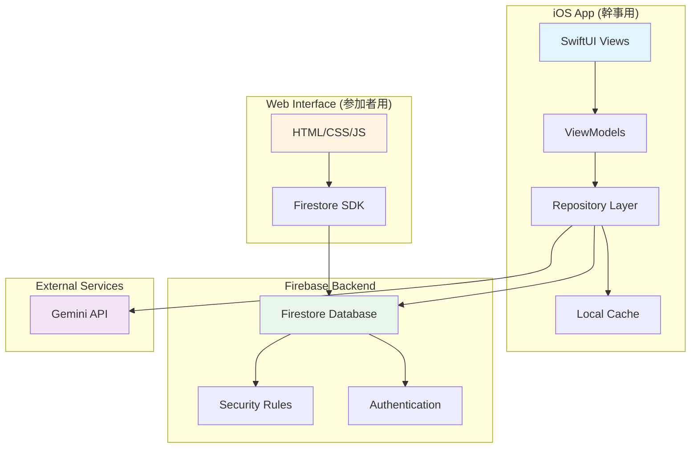

# Design Document: EventFlow

## Overview

EventFlowは、イベント幹事の負担を軽減するためのクロスプラットフォームシステムです。本設計では、iOSネイティブアプリ（幹事用）、Webインターフェース（参加者用）、Firebase Firestoreバックエンド、Gemini AI統合の4つの主要コンポーネントを統合します。

### 設計目標

1. **リアルタイム性**: Firestoreのリアルタイムリスナーを活用し、2秒以内のデータ同期を実現
2. **低摩擦参加**: 参加者はアプリインストール不要でWebブラウザから参加可能
3. **AI支援**: Gemini APIによるイベントテンプレート生成と催促メッセージ生成で幹事の負担を軽減
4. **オフライン対応**: ネットワーク切断時もローカルキューで変更を保持し、再接続時に同期
5. **直感的UI**: SwiftUIによるネイティブiOS体験とスワイプ式タスク選択による参加者の簡単な操作

### 技術スタック

- **iOS App**: SwiftUI + Combine（リアクティブプログラミング）
- **Backend**: Firebase Firestore（NoSQLリアルタイムデータベース）
- **AI**: Google Gemini API（テンプレート生成・メッセージ生成）
- **Web Interface**: HTML/CSS/JavaScript（軽量、フレームワークレス）
- **Authentication**: Firebase Authentication（匿名認証 + オプションでApple/Google）

## Architecture

### システムアーキテクチャ図



### アーキテクチャパターン

#### iOS App: MVVM + Repository Pattern

- **View (SwiftUI)**: UIレンダリングとユーザーインタラクション
- **ViewModel**: ビジネスロジックと状態管理（Combineで監視可能）
- **Repository**: データソースの抽象化（Firestore、ローカルキャッシュ、Gemini API）
- **Model**: データ構造の定義（Codable準拠）

#### Web Interface: シンプルなクライアントサイドアプリ

- Firestore Web SDKを直接使用
- バニラJavaScriptで軽量化（フレームワーク不要）
- リアルタイムリスナーでデータ同期

#### データフロー

1. **幹事 → システム**: iOS App → Repository → Firestore
2. **システム → 参加者**: Firestore → Web Interface (リアルタイムリスナー)
3. **参加者 → システム**: Web Interface → Firestore → iOS App (リアルタイムリスナー)
4. **AI生成**: iOS App → Gemini API → iOS App → Firestore

### レイヤー分離

```
┌─────────────────────────────────────┐
│  Presentation Layer (SwiftUI)       │
├─────────────────────────────────────┤
│  Business Logic Layer (ViewModels)  │
├─────────────────────────────────────┤
│  Data Access Layer (Repositories)   │
├─────────────────────────────────────┤
│  Network Layer (Firebase/Gemini)    │
└─────────────────────────────────────┘
```

## Components and Interfaces

### iOS App コンポーネント

#### 1. EventCreationView
- **責務**: イベント基本情報の入力とAI生成のトリガー
- **入力**: イベントタイプ、参加者数、日時、予算
- **出力**: EventTemplate生成リクエスト
- **依存**: EventViewModel

#### 2. EventDetailView
- **責務**: イベント全体の状況表示と編集
- **表示内容**: タスクリスト、参加者リスト、集金状況、進捗率
- **操作**: テンプレート編集、URL共有、催促メッセージ生成
- **依存**: EventViewModel, TaskViewModel, ParticipantViewModel

#### 3. TaskListView
- **責務**: タスク一覧の表示と管理
- **操作**: タスク追加、編集、削除、ステータス確認
- **依存**: TaskViewModel

#### 4. ParticipantListView
- **責務**: 参加者一覧と支払い状況の表示
- **操作**: 参加者追加、削除、支払い額設定、催促メッセージ生成
- **依存**: ParticipantViewModel

#### 5. EventViewModel
```swift
class EventViewModel: ObservableObject {
    @Published var event: Event?
    @Published var isLoading: Bool = false
    @Published var error: Error?
    
    func generateTemplate(eventType: String, participantCount: Int) async
    func updateEvent(_ event: Event) async
    func shareEventURL() -> URL
    func deleteEvent() async
}
```

#### 6. TaskViewModel
```swift
class TaskViewModel: ObservableObject {
    @Published var tasks: [Task] = []
    @Published var isLoading: Bool = false
    
    func addTask(_ task: Task) async
    func updateTask(_ task: Task) async
    func deleteTask(id: String) async
    func observeTasks(eventId: String)
}
```

#### 7. ParticipantViewModel
```swift
class ParticipantViewModel: ObservableObject {
    @Published var participants: [Participant] = []
    @Published var totalExpected: Double = 0
    @Published var totalCollected: Double = 0
    
    func addParticipant(_ participant: Participant) async
    func updatePaymentStatus(participantId: String, paid: Bool) async
    func generateReminderMessage(participantId: String) async -> String
    func observeParticipants(eventId: String)
}
```

#### 8. EventRepository
```swift
protocol EventRepository {
    func createEvent(_ event: Event) async throws -> String
    func getEvent(id: String) async throws -> Event
    func updateEvent(_ event: Event) async throws
    func deleteEvent(id: String) async throws
    func observeEvent(id: String) -> AsyncStream<Event>
}
```

#### 9. GeminiService
```swift
protocol AIService {
    func generateEventTemplate(eventType: String, participantCount: Int, budget: Double?) async throws -> EventTemplate
    func generateReminderMessage(context: ReminderContext) async throws -> String
}

class GeminiService: AIService {
    private let apiKey: String
    private let endpoint = "https://generativelanguage.googleapis.com/v1/models/gemini-pro:generateContent"
    
    func generateEventTemplate(...) async throws -> EventTemplate
    func generateReminderMessage(...) async throws -> String
}
```

### Web Interface コンポーネント

#### 1. TaskCardView (HTML/CSS/JS)
- **責務**: スワイプ可能なタスクカードの表示
- **機能**: 
  - Hammer.jsまたはネイティブTouch Eventsでスワイプ検出
  - 右スワイプ: タスク引き受け
  - 左スワイプ: スキップ
- **状態管理**: ローカルステート（現在のカードインデックス）

#### 2. ParticipantNameInput
- **責務**: 参加者名の入力（初回アクセス時）
- **保存**: LocalStorageに名前を保存（再入力不要）

#### 3. StatusUpdatePanel
- **責務**: 自分が引き受けたタスクのステータス更新
- **操作**: 完了マーク、メモ追加、支払い完了マーク

#### 4. FirestoreClient (JavaScript)
```javascript
class FirestoreClient {
    constructor(eventId) {
        this.eventId = eventId;
        this.db = firebase.firestore();
    }
    
    observeTasks(callback) {
        return this.db.collection('events').doc(this.eventId)
            .collection('tasks')
            .onSnapshot(callback);
    }
    
    async claimTask(taskId, participantName) {
        await this.db.collection('events').doc(this.eventId)
            .collection('tasks').doc(taskId)
            .update({
                assignedTo: participantName,
                status: 'assigned',
                updatedAt: firebase.firestore.FieldValue.serverTimestamp()
            });
    }
    
    async updateTaskStatus(taskId, status, note) {
        await this.db.collection('events').doc(this.eventId)
            .collection('tasks').doc(taskId)
            .update({
                status: status,
                note: note,
                updatedAt: firebase.firestore.FieldValue.serverTimestamp()
            });
    }
}
```

### API設計

#### Gemini API統合

##### 1. イベントテンプレート生成

**Request:**
```json
{
  "contents": [{
    "parts": [{
      "text": "以下の条件でイベント計画を生成してください：\nイベントタイプ: BBQ\n参加者数: 10人\n予算: 5000円/人\n\n以下のJSON形式で出力してください：\n{\n  \"shoppingList\": [{\"item\": \"商品名\", \"quantity\": \"数量\", \"estimatedCost\": 金額}],\n  \"tasks\": [{\"title\": \"タスク名\", \"description\": \"説明\", \"priority\": \"high/medium/low\"}],\n  \"schedule\": [{\"time\": \"HH:mm\", \"activity\": \"活動内容\"}]\n}"
    }]
  }]
}
```

**Response Processing:**
```swift
struct EventTemplate: Codable {
    let shoppingList: [ShoppingItem]
    let tasks: [TaskTemplate]
    let schedule: [ScheduleItem]
}

func parseGeminiResponse(_ response: String) throws -> EventTemplate {
    // JSONブロックを抽出（```json ... ```の中身）
    let jsonString = extractJSON(from: response)
    let data = jsonString.data(using: .utf8)!
    return try JSONDecoder().decode(EventTemplate.self, from: data)
}
```

##### 2. 催促メッセージ生成

**Request:**
```json
{
  "contents": [{
    "parts": [{
      "text": "以下の状況で丁寧な催促メッセージを生成してください：\n参加者名: 田中さん\n未完了タスク: 飲み物の買い出し\nイベント日: 2024年3月15日\n\n柔らかく、プレッシャーを与えない表現でお願いします。"
    }]
  }]
}
```

**Response:**
```
田中さん、お疲れ様です！
飲み物の買い出しの件ですが、もしお時間あればご対応いただけると助かります。
無理のない範囲で大丈夫ですので、よろしくお願いします！
```

## Data Models

### Firestore データ構造

```
events (collection)
├── {eventId} (document)
│   ├── title: string
│   ├── eventType: string
│   ├── date: timestamp
│   ├── organizerId: string
│   ├── participantCount: number
│   ├── budget: number
│   ├── shareUrl: string
│   ├── createdAt: timestamp
│   ├── updatedAt: timestamp
│   │
│   ├── tasks (subcollection)
│   │   ├── {taskId} (document)
│   │   │   ├── title: string
│   │   │   ├── description: string
│   │   │   ├── priority: string (high/medium/low)
│   │   │   ├── status: string (unassigned/assigned/in_progress/completed)
│   │   │   ├── assignedTo: string (participant name)
│   │   │   ├── note: string
│   │   │   ├── createdAt: timestamp
│   │   │   └── updatedAt: timestamp
│   │
│   ├── participants (subcollection)
│   │   ├── {participantId} (document)
│   │   │   ├── name: string
│   │   │   ├── expectedPayment: number
│   │   │   ├── paymentStatus: string (unpaid/paid)
│   │   │   ├── paidAmount: number
│   │   │   ├── joinedAt: timestamp
│   │   │   └── updatedAt: timestamp
│   │
│   └── shoppingList (subcollection)
│       ├── {itemId} (document)
│       │   ├── item: string
│       │   ├── quantity: string
│       │   ├── estimatedCost: number
│       │   ├── purchased: boolean
│       │   └── purchasedBy: string
```

### Swift Data Models

```swift
struct Event: Identifiable, Codable {
    let id: String
    var title: String
    var eventType: String
    var date: Date
    var organizerId: String
    var participantCount: Int
    var budget: Double
    var shareUrl: String
    var createdAt: Date
    var updatedAt: Date
}

struct Task: Identifiable, Codable {
    let id: String
    var title: String
    var description: String
    var priority: TaskPriority
    var status: TaskStatus
    var assignedTo: String?
    var note: String?
    var createdAt: Date
    var updatedAt: Date
}

enum TaskPriority: String, Codable {
    case high, medium, low
}

enum TaskStatus: String, Codable {
    case unassigned, assigned, inProgress, completed
}

struct Participant: Identifiable, Codable {
    let id: String
    var name: String
    var expectedPayment: Double
    var paymentStatus: PaymentStatus
    var paidAmount: Double
    var joinedAt: Date
    var updatedAt: Date
}

enum PaymentStatus: String, Codable {
    case unpaid, paid
}

struct ShoppingItem: Identifiable, Codable {
    let id: String
    var item: String
    var quantity: String
    var estimatedCost: Double
    var purchased: Bool
    var purchasedBy: String?
}
```

### Firestore Security Rules

```javascript
rules_version = '2';
service cloud.firestore {
  match /databases/{database}/documents {
    // イベントドキュメント
    match /events/{eventId} {
      // 認証済みユーザーは読み取り可能
      allow read: if request.auth != null;
      
      // 作成者のみ書き込み可能
      allow write: if request.auth != null && 
                      request.auth.uid == resource.data.organizerId;
      
      // タスクサブコレクション
      match /tasks/{taskId} {
        // 誰でも読み取り可能（共有URL経由）
        allow read: if true;
        
        // 作成者は全操作可能
        allow write: if request.auth != null && 
                        get(/databases/$(database)/documents/events/$(eventId)).data.organizerId == request.auth.uid;
        
        // 参加者はステータス更新のみ可能
        allow update: if request.resource.data.diff(resource.data).affectedKeys()
                         .hasOnly(['status', 'note', 'updatedAt']);
      }
      
      // 参加者サブコレクション
      match /participants/{participantId} {
        allow read: if true;
        allow create: if true; // 参加者は自分を追加可能
        allow update: if request.resource.data.diff(resource.data).affectedKeys()
                         .hasOnly(['paymentStatus', 'paidAmount', 'updatedAt']);
        allow delete: if request.auth != null && 
                         get(/databases/$(database)/documents/events/$(eventId)).data.organizerId == request.auth.uid;
      }
      
      // 買い物リストサブコレクション
      match /shoppingList/{itemId} {
        allow read: if true;
        allow write: if request.auth != null && 
                        get(/databases/$(database)/documents/events/$(eventId)).data.organizerId == request.auth.uid;
      }
    }
  }
}
```


## Correctness Properties

*A property is a characteristic or behavior that should hold true across all valid executions of a system-essentially, a formal statement about what the system should do. Properties serve as the bridge between human-readable specifications and machine-verifiable correctness guarantees.*

### Property 1: Generated templates contain shopping list with quantities

*For any* event template generated by the AI, the template should contain a shopping list field, and each item in the shopping list should have a non-empty quantity field.

**Validates: Requirements 1.2**

### Property 2: Generated templates contain task assignments

*For any* event template generated by the AI, the template should contain a tasks field with at least one task entry.

**Validates: Requirements 1.3**

### Property 3: Generated templates contain time schedule

*For any* event template generated by the AI, the template should contain a schedule field with at least one time entry.

**Validates: Requirements 1.4**

### Property 4: Adding shopping items increases list length

*For any* shopping list and any valid shopping item, adding the item to the list should result in the list length increasing by one.

**Validates: Requirements 2.1**

### Property 5: Removing shopping items decreases list length

*For any* shopping list with at least one item, removing an item should result in the list length decreasing by one.

**Validates: Requirements 2.2**

### Property 6: Modifying quantities persists changes

*For any* shopping item with a quantity, updating the quantity to a new value should result in the item having the new quantity value when retrieved.

**Validates: Requirements 2.3**

### Property 7: Adding tasks increases task list length

*For any* task list and any valid task, adding the task to the list should result in the list length increasing by one.

**Validates: Requirements 2.4**

### Property 8: Editing task descriptions persists changes

*For any* task with a description, updating the description to a new value should result in the task having the new description when retrieved.

**Validates: Requirements 2.5**

### Property 9: Deleting tasks removes them from list

*For any* task list containing a specific task, deleting that task should result in the task no longer appearing in the list.

**Validates: Requirements 2.6**

### Property 10: Modifying schedule persists changes

*For any* schedule entry, updating its time or activity should result in the entry having the new values when retrieved.

**Validates: Requirements 2.7**

### Property 11: Event URLs are unique

*For any* two different events, their generated shareable URLs should be distinct.

**Validates: Requirements 3.1**

### Property 12: Swiping right assigns task to participant

*For any* unassigned task and any participant name, performing a right swipe action should result in the task being assigned to that participant.

**Validates: Requirements 4.2**

### Property 13: Swiping left advances to next task

*For any* task card at index N in a task list, performing a left swipe should result in the card at index N+1 being displayed (if it exists).

**Validates: Requirements 4.3**

### Property 14: Assigned tasks display as unavailable

*For any* task that has an assignedTo field with a non-null value, the task should be marked as unavailable when displayed to other participants.

**Validates: Requirements 4.5**

### Property 15: Progress indicator reflects completion ratio

*For any* event with N total tasks and M completed tasks, the progress indicator should display M/N as the completion ratio.

**Validates: Requirements 5.3**

### Property 16: Task status is displayed for each task

*For any* task in the system, when displayed, it should show its current status value (unassigned, assigned, in_progress, or completed).

**Validates: Requirements 5.4**

### Property 17: Payment status is displayed for each participant

*For any* participant in the system, when displayed, they should show their current payment status (paid or unpaid).

**Validates: Requirements 5.5**

### Property 18: Marking task as completed updates status

*For any* task assigned to a participant, when the participant marks it as completed, the task status should change to "completed".

**Validates: Requirements 6.1**

### Property 19: Marking payment as completed updates status

*For any* participant with unpaid status, when they mark payment as completed, their payment status should change to "paid".

**Validates: Requirements 6.2**

### Property 20: Adding notes to tasks persists them

*For any* task and any note text, adding the note to the task should result in the task having that note when retrieved.

**Validates: Requirements 6.3**

### Property 21: Offline changes are queued and synced

*For any* data modification made while offline, the change should be queued locally, and when connection is restored, the change should be synchronized to Firestore such that retrieving the data returns the modified value.

**Validates: Requirements 8.2, 8.3**

### Property 22: Created events can be retrieved

*For any* event created by an organizer, querying for that event by its ID should return the event with the same data.

**Validates: Requirements 8.4**

### Property 23: Adding participants increases participant list length

*For any* participant list and any valid participant, adding the participant to the list should result in the list length increasing by one.

**Validates: Requirements 9.1**

### Property 24: Claiming task creates participant entry

*For any* event and any participant name not yet in the participant list, when that participant claims a task, a participant entry with that name should be automatically created.

**Validates: Requirements 9.2**

### Property 25: Participant count matches list length

*For any* event, the displayed participant count should equal the actual number of entries in the participant list.

**Validates: Requirements 9.3**

### Property 26: Removing participants decreases list length

*For any* participant list with at least one participant, removing a participant should result in the list length decreasing by one.

**Validates: Requirements 9.4**

### Property 27: Setting expected payment persists value

*For any* participant and any payment amount, setting the expected payment to that amount should result in the participant having that expected payment value when retrieved.

**Validates: Requirements 9.5**

### Property 28: Total expected payment equals sum of individual expectations

*For any* event with participants, the total expected payment amount should equal the sum of all individual participant expected payment amounts.

**Validates: Requirements 10.1**

### Property 29: Total collected payment equals sum of paid amounts

*For any* event with participants, the total collected payment amount should equal the sum of all participant paid amounts where payment status is "paid".

**Validates: Requirements 10.2**

### Property 30: Outstanding payment equals expected minus collected

*For any* event, the outstanding payment amount should equal the total expected payment minus the total collected payment.

**Validates: Requirements 10.3**

### Property 31: Payment status displayed matches stored value

*For any* participant, the displayed payment status should match the payment status value stored in the database.

**Validates: Requirements 10.4**

### Property 32: Payment completion percentage calculation

*For any* event where total expected payment is greater than zero, the payment completion percentage should equal (total collected / total expected) × 100.

**Validates: Requirements 10.5**

### Property 33: Unauthenticated requests are rejected

*For any* request to access event data without valid authentication credentials, the system should reject the request and return an authentication error.

**Validates: Requirements 11.1**

### Property 34: Unauthorized access is denied

*For any* attempt to access or modify event data by a user who is not the event organizer (except for allowed participant operations), the system should deny the request.

**Validates: Requirements 11.2**

### Property 35: Event URL only returns data for that event

*For any* event accessed via its shareable URL, the returned data should only include information belonging to that specific event, not other events.

**Validates: Requirements 11.3**

### Property 36: All network URLs use HTTPS

*For any* network request made by the application, the URL should use the "https://" scheme.

**Validates: Requirements 11.5**

### Property 37: Errors are logged

*For any* error that occurs in the system, an error log entry should be created with relevant error information.

**Validates: Requirements 12.5**

## Error Handling

### エラー分類と処理戦略

#### 1. ネットワークエラー

**発生箇所**: Firestore操作、Gemini API呼び出し

**処理方法**:
- ユーザーに分かりやすいエラーメッセージを表示
- 自動リトライ（指数バックオフ: 1秒、2秒、4秒）
- オフラインモードへの切り替え（Firestore操作の場合）
- ローカルキャッシュからのデータ提供

**実装例**:
```swift
func fetchEvent(id: String) async throws -> Event {
    var retryCount = 0
    let maxRetries = 3
    
    while retryCount < maxRetries {
        do {
            return try await repository.getEvent(id: id)
        } catch let error as NetworkError {
            retryCount += 1
            if retryCount >= maxRetries {
                // ローカルキャッシュを試す
                if let cachedEvent = localCache.getEvent(id: id) {
                    return cachedEvent
                }
                throw EventError.networkUnavailable
            }
            let delay = pow(2.0, Double(retryCount))
            try await Task.sleep(nanoseconds: UInt64(delay * 1_000_000_000))
        }
    }
    throw EventError.maxRetriesExceeded
}
```

#### 2. AI生成エラー

**発生箇所**: Gemini APIレスポンス解析、レート制限

**処理方法**:
- エラーメッセージ表示（「AIが応答できませんでした。もう一度お試しください」）
- リトライボタンの提供
- レート制限の場合は待機時間を表示
- フォールバック: 手動入力モードへの切り替え

**実装例**:
```swift
enum AIError: LocalizedError {
    case rateLimitExceeded(retryAfter: TimeInterval)
    case invalidResponse
    case apiKeyInvalid
    
    var errorDescription: String? {
        switch self {
        case .rateLimitExceeded(let seconds):
            return "AI生成の制限に達しました。\(Int(seconds))秒後に再試行してください。"
        case .invalidResponse:
            return "AIの応答を解析できませんでした。もう一度お試しください。"
        case .apiKeyInvalid:
            return "AI接続に問題があります。アプリを再起動してください。"
        }
    }
}
```

#### 3. データ検証エラー

**発生箇所**: ユーザー入力、Firestoreデータ読み込み

**処理方法**:
- インラインバリデーションメッセージ（入力フィールド下に赤文字で表示）
- 無効な状態では送信ボタンを無効化
- データ破損の場合はデフォルト値で復旧を試みる

**バリデーションルール**:
```swift
struct ValidationRules {
    static func validateEventTitle(_ title: String) -> ValidationResult {
        if title.trimmingCharacters(in: .whitespaces).isEmpty {
            return .invalid("イベント名を入力してください")
        }
        if title.count > 100 {
            return .invalid("イベント名は100文字以内で入力してください")
        }
        return .valid
    }
    
    static func validateParticipantCount(_ count: Int) -> ValidationResult {
        if count < 1 {
            return .invalid("参加者数は1人以上である必要があります")
        }
        if count > 1000 {
            return .invalid("参加者数は1000人以下である必要があります")
        }
        return .valid
    }
    
    static func validatePaymentAmount(_ amount: Double) -> ValidationResult {
        if amount < 0 {
            return .invalid("金額は0以上である必要があります")
        }
        return .valid
    }
}
```

#### 4. 認証エラー

**発生箇所**: Firebase Authentication、Firestoreアクセス

**処理方法**:
- 自動再認証の試行
- 失敗時はログイン画面へリダイレクト
- セッション期限切れの明確な通知

#### 5. 権限エラー

**発生箇所**: Firestore Security Rules違反

**処理方法**:
- 「この操作を実行する権限がありません」メッセージ
- 適切な画面へのナビゲーション（例: 参加者が幹事専用機能にアクセスした場合）

### エラーログ戦略

```swift
protocol ErrorLogger {
    func log(error: Error, context: [String: Any])
}

class FirebaseErrorLogger: ErrorLogger {
    func log(error: Error, context: [String: Any]) {
        var logData: [String: Any] = [
            "error_type": String(describing: type(of: error)),
            "error_description": error.localizedDescription,
            "timestamp": Date().timeIntervalSince1970,
            "app_version": Bundle.main.infoDictionary?["CFBundleShortVersionString"] as? String ?? "unknown"
        ]
        
        logData.merge(context) { (_, new) in new }
        
        // Firebase Crashlyticsへ送信
        Crashlytics.crashlytics().record(error: error, userInfo: logData)
        
        // 開発環境ではコンソールにも出力
        #if DEBUG
        print("🔴 Error logged: \(logData)")
        #endif
    }
}
```

## Testing Strategy

### テスト戦略の概要

EventFlowの品質保証には、ユニットテスト（Unit Tests）とプロパティベーステスト（Property-Based Tests）の両方を使用します。これらは相補的な関係にあり、両方が必要です。

- **ユニットテスト**: 特定の例、エッジケース、エラー条件を検証
- **プロパティベーステスト**: すべての入力に対して成り立つべき普遍的なプロパティを検証

### ユニットテストの焦点

ユニットテストは以下に焦点を当てます：

1. **具体的な例**: 正常系の動作を示す代表的なケース
2. **エッジケース**: 空のリスト、境界値、特殊文字など
3. **エラー条件**: ネットワークエラー、認証失敗、バリデーションエラー
4. **統合ポイント**: コンポーネント間の連携

プロパティベーステストが多くの入力をカバーするため、ユニットテストは過度に多く書く必要はありません。

### プロパティベーステストの設定

#### テストライブラリ

- **Swift**: [swift-check](https://github.com/typelift/SwiftCheck) を使用
- **JavaScript (Web Interface)**: [fast-check](https://github.com/dubzzz/fast-check) を使用

#### 設定要件

- 各プロパティテストは最低100回の反復を実行（ランダム性のため）
- 各テストには設計ドキュメントのプロパティを参照するタグを付ける
- タグ形式: `// Feature: event-flow, Property {number}: {property_text}`

#### プロパティテスト実装例

```swift
import XCTest
import SwiftCheck

class EventFlowPropertyTests: XCTestCase {
    
    // Feature: event-flow, Property 4: Adding shopping items increases list length
    func testAddingShoppingItemIncreasesListLength() {
        property("Adding any valid shopping item increases list length by 1") <- forAll { (item: ShoppingItem) in
            var shoppingList = ShoppingList()
            let initialCount = shoppingList.items.count
            
            shoppingList.add(item)
            
            return shoppingList.items.count == initialCount + 1
        }
    }
    
    // Feature: event-flow, Property 21: Offline changes are queued and synced
    func testOfflineChangesRoundTrip() {
        property("Changes made offline are synced when online") <- forAll { (event: Event) in
            let repository = EventRepository()
            
            // オフラインモードに設定
            repository.setOfflineMode(true)
            
            // イベントを更新
            let updatedEvent = event.with(title: "Updated Title")
            try? await repository.updateEvent(updatedEvent)
            
            // オンラインモードに戻す
            repository.setOfflineMode(false)
            
            // 同期を待つ
            try? await Task.sleep(nanoseconds: 2_000_000_000)
            
            // データを取得
            let retrievedEvent = try? await repository.getEvent(id: event.id)
            
            return retrievedEvent?.title == "Updated Title"
        }
    }
    
    // Feature: event-flow, Property 28: Total expected payment equals sum of individual expectations
    func testTotalExpectedPaymentCalculation() {
        property("Total expected equals sum of individual expectations") <- forAll { (participants: [Participant]) in
            let event = Event(participants: participants)
            
            let calculatedTotal = participants.reduce(0.0) { $0 + $1.expectedPayment }
            let eventTotal = event.totalExpectedPayment
            
            return abs(calculatedTotal - eventTotal) < 0.01 // 浮動小数点の誤差を考慮
        }
    }
}
```

#### JavaScript プロパティテスト例

```javascript
const fc = require('fast-check');

describe('EventFlow Property Tests', () => {
    
    // Feature: event-flow, Property 12: Swiping right assigns task to participant
    test('Swiping right on any task assigns it to participant', () => {
        fc.assert(
            fc.property(
                fc.record({
                    id: fc.string(),
                    title: fc.string(),
                    status: fc.constantFrom('unassigned', 'assigned', 'in_progress', 'completed')
                }),
                fc.string().filter(s => s.length > 0),
                async (task, participantName) => {
                    const client = new FirestoreClient('test-event-id');
                    
                    await client.claimTask(task.id, participantName);
                    
                    const updatedTask = await client.getTask(task.id);
                    return updatedTask.assignedTo === participantName;
                }
            ),
            { numRuns: 100 }
        );
    });
    
    // Feature: event-flow, Property 11: Event URLs are unique
    test('Generated URLs are unique for different events', () => {
        fc.assert(
            fc.property(
                fc.array(fc.record({
                    id: fc.uuid(),
                    title: fc.string()
                }), { minLength: 2, maxLength: 10 }),
                (events) => {
                    const urls = events.map(event => generateShareUrl(event.id));
                    const uniqueUrls = new Set(urls);
                    return urls.length === uniqueUrls.size;
                }
            ),
            { numRuns: 100 }
        );
    });
});
```

### ユニットテスト例

```swift
class EventViewModelTests: XCTestCase {
    
    // 具体的な例: AI生成エラー時のリトライ機能
    func testAIGenerationErrorShowsRetryOption() async {
        let mockService = MockGeminiService()
        mockService.shouldFail = true
        let viewModel = EventViewModel(aiService: mockService)
        
        await viewModel.generateTemplate(eventType: "BBQ", participantCount: 10)
        
        XCTAssertNotNil(viewModel.error)
        XCTAssertTrue(viewModel.canRetry)
    }
    
    // エッジケース: 空の参加者リストでの集金計算
    func testPaymentCalculationWithNoParticipants() {
        let event = Event(participants: [])
        
        XCTAssertEqual(event.totalExpectedPayment, 0.0)
        XCTAssertEqual(event.totalCollectedPayment, 0.0)
        XCTAssertEqual(event.outstandingPayment, 0.0)
    }
    
    // エラー条件: ネットワーク切断時のローカルキューイング
    func testOfflineChangesAreQueued() async {
        let repository = EventRepository()
        repository.setOfflineMode(true)
        
        let event = Event(title: "Test Event")
        try? await repository.updateEvent(event)
        
        XCTAssertTrue(repository.hasQueuedChanges)
        XCTAssertEqual(repository.queuedChanges.count, 1)
    }
}
```

### テストカバレッジ目標

- **コードカバレッジ**: 最低80%（ビジネスロジックとデータレイヤー）
- **プロパティカバレッジ**: 設計ドキュメントの全37プロパティを実装
- **エッジケースカバレッジ**: 各主要機能に対して最低3つのエッジケーステスト

### CI/CD統合

```yaml
# .github/workflows/test.yml
name: Test

on: [push, pull_request]

jobs:
  test:
    runs-on: macos-latest
    steps:
      - uses: actions/checkout@v2
      
      - name: Run Unit Tests
        run: xcodebuild test -scheme EventFlow -destination 'platform=iOS Simulator,name=iPhone 15'
      
      - name: Run Property Tests
        run: xcodebuild test -scheme EventFlowPropertyTests -destination 'platform=iOS Simulator,name=iPhone 15'
      
      - name: Upload Coverage
        uses: codecov/codecov-action@v2
```

### テスト実行順序

1. **開発中**: ユニットテストを頻繁に実行（高速フィードバック）
2. **コミット前**: 全ユニットテスト + プロパティテスト（100反復）
3. **CI/CD**: 全テスト + プロパティテスト（1000反復、より徹底的）
4. **リリース前**: 全テスト + 手動E2Eテスト + パフォーマンステスト

